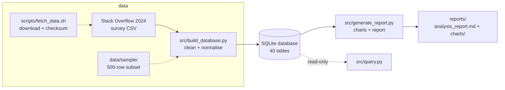
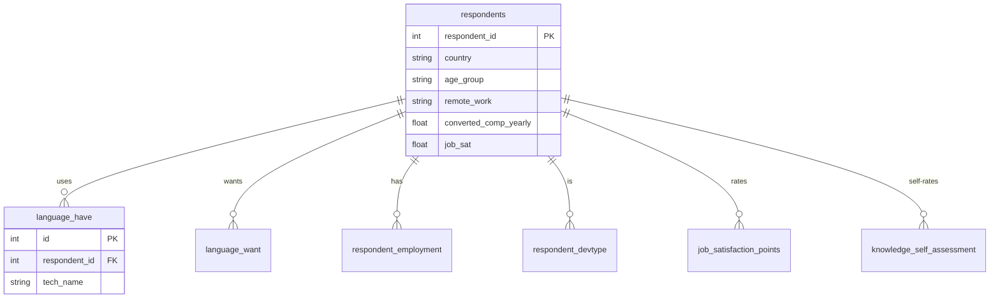
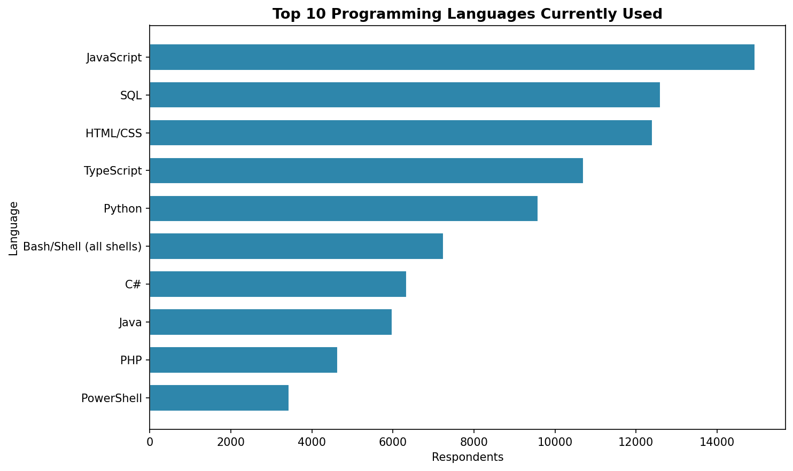
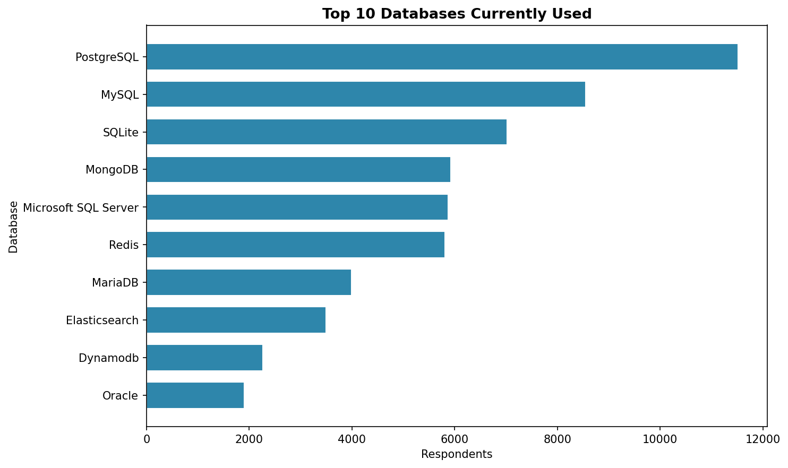
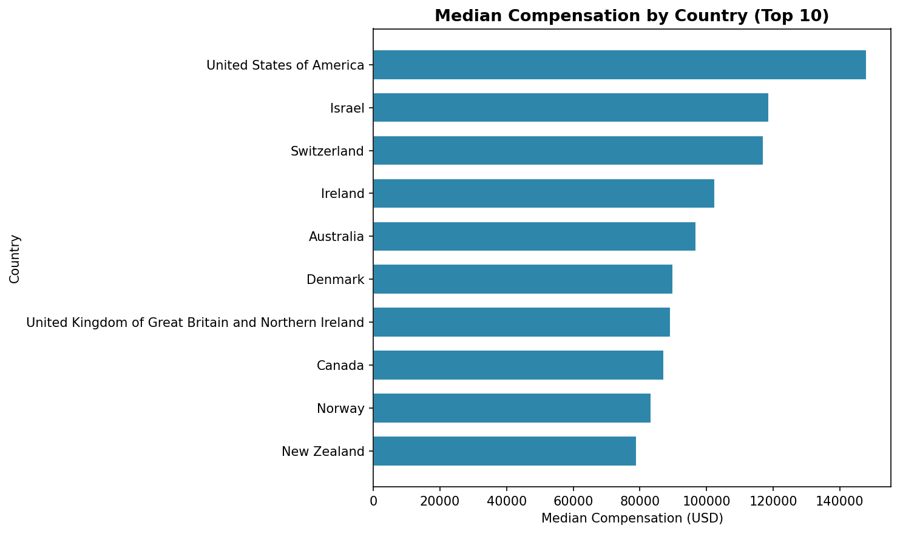

# Survey Data Analysis — Stack Overflow 2024


A reproducible, end-to-end analysis of the Stack Overflow 2024 Developer Survey —
**18,845 responses, 114 columns, 40 normalised tables** — taken from a raw CSV to a
documented database, a generated report, and a tested pipeline you can run in one command.

Built and maintained by [@malikb0](https://github.com/malikb0).

> Independent portfolio work — not affiliated with or endorsed by IBM, Coursera, or Stack
> Overflow. See [`NOTICE.md`](NOTICE.md).

## About this project

This is a self-contained data-analysis project, organised so you can understand it
end-to-end without prior context:

1. **What it does** — cleans the survey, models it relationally, and produces charts and findings.
2. **How to run it** — `make setup && make demo` (offline) or the full pipeline on the real data.
3. **How it is documented** — every step has a document; see the [documentation map](#documentation-map).
4. **What it proves and what it doesn't** — methodology and limitations are written down, not implied.

| At a glance | |
|---|---|
| **Type** | Data analysis / ETL portfolio project |
| **Stack** | Python 3.10 · pandas · NumPy · matplotlib · SQLite |
| **Dataset** | Stack Overflow Developer Survey 2024 (ODbL) |
| **Scale** | 18,845 respondents · 114 columns · 40 tables · 8 findings |
| **Output** | SQLite database · charts · a generated Markdown report |
| **Quality** | 32 deterministic tests · byte-identical report reruns · CI |
| **License** | MIT (code/docs); dataset ODbL; course labs excluded |

### Questions this project answers

- Which languages and tools do developers use — and want to use next?
- How do pay and satisfaction vary by remote work, role, country, and age?
- How mainstream are AI tools, and how do developers feel about them?

## Documentation map

| Document | What it is |
|---|---|
| [docs/README.md](docs/README.md) | Documentation index and pipeline diagram. |
| [docs/methodology.md](docs/methodology.md) | Cleaning rules, normalisation, schema, reproducibility. |
| [docs/results.md](docs/results.md) | The eight headline findings, each with its SQL query. |
| [docs/limitations.md](docs/limitations.md) | What the analysis does and does not prove. |
| [docs/data-dictionary.md](docs/data-dictionary.md) | All 40 SQLite tables and the 114 source columns. |
| [reports/analysis_report.md](reports/analysis_report.md) | The generated report (charts + computed figures). |
| [docs/capstone-report.pdf](docs/capstone-report.pdf) | The original written capstone report (export). |
| [labs/README.md](labs/README.md) | Index of the IBM/Coursera course notebooks. |
| [data/README.md](data/README.md) | Data layout and how to fetch the full survey. |
| [scripts/README.md](scripts/README.md) | The data-download helper. |
| [CONTRIBUTING.md](CONTRIBUTING.md) | Conventions for working on the repo. |
| [CHANGELOG.md](CHANGELOG.md) | Notable changes. |
| [NOTICE.md](NOTICE.md) | Attribution, provenance, and license scope. |
| [CITATION.cff](CITATION.cff) | How to cite this project and the dataset. |

## Contents

- [About this project](#about-this-project)
- [Documentation map](#documentation-map)
- [Architecture](#architecture)
- [Results at a glance](#results-at-a-glance)
- [Screenshots](#screenshots)
- [Repository structure](#repository-structure)
- [Quickstart](#quickstart)
- [Make targets](#make-targets)
- [Data](#data)
- [Reproducibility](#reproducibility)
- [Limitations](#limitations)
- [Contributing](#contributing)
- [Attribution & license](#attribution--license)

## Architecture



The database is fully relational — one row per respondent, 33 per-category technology
tables (11 categories × have/want/admired), and 6 junction tables:



Full schema: [`docs/data-dictionary.md`](docs/data-dictionary.md).

## Results at a glance

All figures are computed from the canonical run (18,845 respondents); full sourcing, queries
and caveats in [`docs/results.md`](docs/results.md).

| Finding | Figure |
|---|---|
| Most-used language | **JavaScript — 79.3%** (also most-wanted, 61.2%) |
| Strongest want/have signal | **Rust — 2.45×** (2,284 use, 5,597 want) |
| Leading database | **PostgreSQL — 61.1% use, 64.7% want** |
| Remote vs in-person pay | **$90,712 vs $55,850** median |
| Global vs US median pay | **$65,858** global; **$148,000** US (30+ respondents) |
| AI sentiment | **11,420 favourable** vs **901 unfavourable** |

## Screenshots

| Top languages used | Top databases used | Median pay by country |
|---|---|---|
|  |  |  |

The full set of generated charts lives in [`reports/charts/`](reports/charts).

## Repository structure

```text
.
├── src/                     # pipeline source
│   ├── build_database.py    #   CSV -> normalised SQLite
│   ├── generate_report.py   #   SQLite -> charts + Markdown report
│   └── query.py             #   read-only SQL helper
├── scripts/
│   └── fetch_data.sh        # download the official survey + checksum
├── data/
│   ├── sample/              # committed 500-row subset (offline demo)
│   ├── raw/                 # git-ignored: official download
│   └── interim/             # git-ignored: working CSVs
├── docs/                    # methodology, results, limitations, data dictionary
│   ├── README.md            #   documentation index
│   ├── methodology.md
│   ├── results.md
│   ├── limitations.md
│   ├── data-dictionary.md
│   ├── capstone-report.pdf
│   └── images/
├── labs/                    # IBM/Coursera coursework (not MIT) - see labs/README.md
│   ├── notebooks/
│   └── data/
├── reports/                 # committed rendered report + charts/
├── tests/                   # deterministic tests
├── build/                   # git-ignored local artifacts (databases, demo output)
├── Makefile
├── requirements.txt
├── pyproject.toml
├── README.md  LICENSE  NOTICE.md  CITATION.cff
└── CONTRIBUTING.md  CHANGELOG.md
```

## Quickstart

Requires **Python 3.10** and `make`.

```bash
git clone https://github.com/malikb0/IBM-data-analyst-capstone.git
cd IBM-data-analyst-capstone
make setup     # create .venv + install pinned deps
make demo      # end-to-end on the committed sample: offline, deterministic
```

`make demo` builds a SQLite database from the 500-row sample and writes charts + a report to
`build/demo/`. To run the full analysis on the official survey:

```bash
make fetch-data   # download the official survey into data/raw/ (+ verify)
make build-db     # CSV  -> build/survey_cleaned.sqlite
make report       # DB   -> reports/ charts + report
```

## Make targets

| Target | Purpose |
|---|---|
| `make setup` | Create the virtualenv and install pinned dependencies. |
| `make demo` | Offline end-to-end run on the committed sample → `build/demo/`. |
| `make test` | Fast deterministic unit/integration tests. |
| `make fetch-data` | Download the official survey archive into `data/raw/`. |
| `make build-db` | Build `build/survey_cleaned.sqlite` from the full CSV. |
| `make report` | Generate charts and the report into `reports/`. |
| `make query Q="SELECT ..."` | Run a read-only query against the database. |
| `make clean` | Remove local generated artifacts. |

## Data

- **Source:** Stack Overflow Developer Survey 2024 (public; ODbL). Attribution:
  "Stack Overflow Developer Survey 2024".
- **Not committed in full.** `make fetch-data` downloads the official archive into
  `data/raw/` and records a SHA-256.
- **A 500-row subset is committed** (`data/sample/so_survey_sample.csv`) so `make demo`
  runs with **no download and no network**.
- The published analysis uses an **18,845-row working subset**; running on the official
  file (65k+ responses) yields different absolute counts. Recorded in
  [`docs/methodology.md`](docs/methodology.md) §1 and [`docs/limitations.md`](docs/limitations.md).

Details and overrides: [`data/README.md`](data/README.md), [`scripts/README.md`](scripts/README.md).

## Reproducibility

- `make test` runs the deterministic suite (cleaning helpers, ETL integration, and report
  idempotency — the report is byte-identical across runs); **32 tests pass**.
- `make demo` proves the pipeline end-to-end offline from the committed sample.
- Every number in the report is computed at run time; the narrative claims are generated,
  not hardcoded.
- CI runs the test suite on every push — see [`.github/workflows/ci.yml`](.github/workflows/ci.yml).

## Limitations

Self-selected respondents, self-reported figures, a single survey year, nominal USD
compensation, and mapping/cleaning choices all bound what these charts can claim. Charts
are descriptive, not causal. Read [`docs/limitations.md`](docs/limitations.md) before
drawing conclusions.

## Contributing

See [`CONTRIBUTING.md`](CONTRIBUTING.md) for layout, conventions, and the rule that the
`labs/` course notebooks are kept as-is.

## Attribution & license

- **Original work** (pipeline, report, docs, tests, scripts) is **MIT** — see [`LICENSE`](LICENSE).
- **Course work:** the `labs/notebooks/*.ipynb` notebooks were completed for the IBM Data
  Analyst Professional Certificate on Coursera and remain IBM/Coursera material; they are
  included as credited coursework and are **not** covered by the MIT license.
- **Dataset:** Stack Overflow Developer Survey 2024, under its own (ODbL) terms.
- Full details, including third-party assets and a security note: [`NOTICE.md`](NOTICE.md).

To cite this project, see [`CITATION.cff`](CITATION.cff).

_This project is independent coursework and is not affiliated with or endorsed by IBM,
Coursera, or Stack Overflow._
