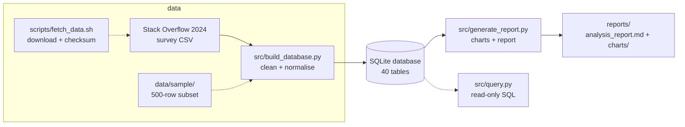

# Documentation

Supporting documentation for the Stack Overflow 2024 survey analysis. Start with the
root [`README.md`](../README.md) for the overview and quickstart.

| Document | What it covers |
|---|---|
| [`methodology.md`](methodology.md) | Cleaning rules, normalisation, and the exact dataset used. |
| [`results.md`](results.md) | Headline findings with the SQL queries behind them. |
| [`limitations.md`](limitations.md) | What the analysis does and does not prove. |
| [`data-dictionary.md`](data-dictionary.md) | The 40 SQLite tables and the 114 source columns. |
| [`capstone-report.pdf`](capstone-report.pdf) | The original written capstone report (export). |

The **generated** analysis report (charts + figures) lives at
[`../reports/analysis_report.md`](../reports/analysis_report.md) and is produced by
`src/generate_report.py`. Regenerate it with `make demo` (offline) or
`make fetch-data && make build-db && make report` (full run).

## Pipeline at a glance

See [`methodology.md`](methodology.md) for the design of each step, and
[`data-dictionary.md`](data-dictionary.md) for the relational schema.
