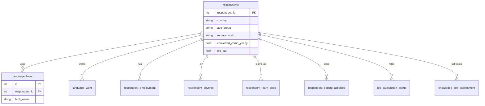

# Data Dictionary

Source: **Stack Overflow Developer Survey 2024**, 114 columns. `src/build_database.py`
normalises it into **40 SQLite tables** (one fact table, 33 technology tables, 6 junction
tables).

> The original hand-written report said "39 tables"; the actual generated schema has
> **40** (`respondents` + 11 categories × 3 variants + 6 child tables). This file reflects
> the generated schema.

Regenerate the schema at any time:

```bash
python src/query.py "SELECT name FROM sqlite_master WHERE type='table' ORDER BY name"
python src/query.py "PRAGMA table_info(respondents)"
```

## Contents

1. [Fact table — `respondents`](#1-fact-table--respondents-18845-rows-30-columns)
2. [Technology tables (33)](#2-technology-tables--11-categories--3-variants--33-tables)
3. [Junction / long-format tables](#3-junction--long-format-tables)
4. [The 114 source columns, by theme](#4-the-114-source-columns-by-theme)

## Schema at a glance



> The diagram shows representative tables. The full schema adds the remaining technology
> tables (`Database`, `Platform`, `Webframe`, `Embedded`, `MiscTech`, `ToolsTech`,
> `NEWCollabTools`, `OfficeStackAsync`, `OfficeStackSync`, `AISearchDev`), each with
> `_have`, `_want` and `_admired` variants.

## 1. Fact table — `respondents` (18,845 rows, 30 columns)

One row per participant. Columns are typed REAL or TEXT/NULL.

| Column | Type | Source column | Cleaning / notes |
|---|---|---|---|
| `respondent_id` | INTEGER PK | `ResponseId` | — |
| `main_branch` | TEXT | `MainBranch` | — |
| `age_group` | TEXT | `Age` | mapped to bands; `Prefer not to say`/unmapped → NULL |
| `remote_work` | TEXT | `RemoteWork` | — |
| `ed_level` | TEXT | `EdLevel` | — |
| `years_code` | REAL | `YearsCode` | sentinel map (`clean_years`) |
| `years_code_pro` | REAL | `YearsCodePro` | sentinel map (`clean_years`) |
| `org_size` | TEXT | `OrgSize` | — |
| `country` | TEXT | `Country` | — |
| `converted_comp_yearly` | REAL | `ConvertedCompYearly` | 99th-percentile cap; NaN preserved |
| `work_exp` | REAL | `WorkExp` | — |
| `job_sat` | REAL | `JobSat` | — |
| `icor_pm` | TEXT | `ICorPM` | individual contributor vs people manager |
| `t_branch` | TEXT | `TBranch` | professional developer series flag |
| `industry` | TEXT | `Industry` | — |
| `os_personal` | TEXT | `OpSysPersonal use` | — |
| `os_professional` | TEXT | `OpSysProfessional use` | — |
| `so_visit_freq` | TEXT | `SOVisitFreq` | — |
| `so_account` | TEXT | `SOAccount` | — |
| `so_part_freq` | TEXT | `SOPartFreq` | — |
| `so_comm` | TEXT | `SOComm` | — |
| `ai_select` | TEXT | `AISelect` | AI tool use |
| `ai_sent` | TEXT | `AISent` | AI sentiment |
| `ai_ben` | TEXT | `AIBen` | — |
| `ai_acc` | TEXT | `AIAcc` | — |
| `ai_complex` | TEXT | `AIComplex` | — |
| `ai_threat` | TEXT | `AIThreat` | — |
| `ai_ethics` | TEXT | `AIEthics` | — |
| `survey_length` | TEXT | `SurveyLength` | — |
| `survey_ease` | TEXT | `SurveyEase` | — |

## 2. Technology tables — 11 categories × 3 variants = 33 tables

Each table has the shape `(id INTEGER PK, respondent_id INTEGER FK, tech_name TEXT)` and
one row per `(respondent_id, tech_name)` (de-duplicated).

| Category prefix (table prefix) | Tables (rows in canonical run) |
|---|---|
| `Language` | `Language_have` (116,557), `Language_want` (106,356), `Language_admired` (83,523) |
| `Database` | `Database_have` (69,586), `Database_want` (65,913), `Database_admired` (49,898) |
| `Platform` | `Platform_have` (50,655), `Platform_want` (48,410), `Platform_admired` (36,883) |
| `Webframe` | `Webframe_have` (77,803), `Webframe_want` (71,417), `Webframe_admired` (52,759) |
| `Embedded` | `Embedded_have` (15,629), `Embedded_want` (13,538), `Embedded_admired` (11,486) |
| `MiscTech` | `MiscTech_have` (45,338), `MiscTech_want` (47,158), `MiscTech_admired` (30,862) |
| `ToolsTech` | `ToolsTech_have` (99,274), `ToolsTech_want` (87,561), `ToolsTech_admired` (73,925) |
| `NEWCollabTools` | `NEWCollabTools_have` (70,906), `NEWCollabTools_want` (57,509), `NEWCollabTools_admired` (51,831) |
| `OfficeStackAsync` | `OfficeStackAsync_have` (52,820), `OfficeStackAsync_want` (39,934), `OfficeStackAsync_admired` (35,419) |
| `OfficeStackSync` | `OfficeStackSync_have` (68,172), `OfficeStackSync_want` (48,988), `OfficeStackSync_admired` (45,675) |
| `AISearchDev` | `AISearchDev_have` (40,256), `AISearchDev_want` (36,760), `AISearchDev_admired` (30,736) |

- `*_have` ← `<Category>HaveWorkedWith`
- `*_want` ← `<Category>WantToWorkWith`
- `*_admired` ← `<Category>Admired`

De-dup key: `(respondent_id, tech_name)`.

## 3. Junction / long-format tables

| Table | Rows | Value column | Source | De-dup key |
|---|---|---|---|---|
| `respondent_employment` | 23,267 | `employment_type` | `Employment` | `(respondent_id, employment_type)` |
| `respondent_devtype` | 18,801 | `dev_type` | `DevType` | `(respondent_id, dev_type)` |
| `respondent_learn_code` | 65,255 | `learning_source` | `LearnCode` | `(respondent_id, learning_source)` |
| `respondent_coding_activities` | 40,948 | `activity` | `CodingActivities` | `(respondent_id, activity)` |
| `job_satisfaction_points` | 109,584 | `aspect`, `score` | `JobSatPoints_1,4..11` | `(respondent_id, aspect)` |
| `knowledge_self_assessment` | 105,015 | `knowledge_area`, `response`, `score` | `Knowledge_1..9` | `(respondent_id, knowledge_area)` |

`job_satisfaction_points.aspect` values (9): `career_satisfaction`, `coworkers`,
`work_life_balance`, `compensation`, `resources`, `autonomy`, `growth`, `management`,
`retention`.

`knowledge_self_assessment.score` is the Likert score 1–5 (`Strongly disagree` …
`Strongly agree`); an unmapped `response` is kept with `score = NULL` and a build warning.

## 4. The 114 source columns, by theme

| Theme | Columns |
|---|---|
| Identity & profile | `ResponseId`, `MainBranch`, `Age`, `EdLevel`, `Country`, `Currency`, `Employment`, `DevType`, `OrgSize`, `WorkExp`, `ICorPM`, `TBranch`, `Industry`, `RemoteWork` |
| Learning & work context | `CodingActivities`, `LearnCode`, `LearnCodeOnline`, `TechDoc`, `PurchaseInfluence`, `BuyNewTool`, `BuildvsBuy`, `TechEndorse` |
| Technology (multi-value, 33) | `<Category>{HaveWorkedWith,WantToWorkWith,Admired}` for `Language`, `Database`, `Platform`, `Webframe`, `Embedded`, `MiscTech`, `ToolsTech`, `NEWCollabTools`, `OfficeStackAsync`, `OfficeStackSync`, `AISearchDev` |
| Operating systems | `OpSysPersonal use`, `OpSysProfessional use` |
| Stack Overflow community | `NEWSOSites`, `SOVisitFreq`, `SOAccount`, `SOPartFreq`, `SOHow`, `SOComm` |
| AI | `AISelect`, `AISent`, `AIBen`, `AIAcc`, `AIComplex`, `AIToolCurrently Using`, `AIToolInterested in Using`, `AIToolNot interested in Using`, `AINextMuch more integrated`, `AINextNo change`, `AINextMore integrated`, `AINextLess integrated`, `AINextMuch less integrated`, `AIThreat`, `AIEthics`, `AIChallenges` |
| Satisfaction & knowledge | `Knowledge_1`…`Knowledge_9`, `Frequency_1`…`Frequency_3`, `TimeSearching`, `TimeAnswering`, `Frustration`, `ProfessionalTech`, `ProfessionalCloud`, `ProfessionalQuestion`, `JobSatPoints_1`, `JobSatPoints_4`…`JobSatPoints_11`, `JobSat` |
| Compensation | `CompTotal`, `ConvertedCompYearly` |
| Survey meta | `Check`, `SurveyLength`, `SurveyEase` |

> Only a subset of the 114 columns is loaded into the database. Columns not listed under
> §1–§3 (e.g. `Check`, `AINext*`, `Frequency_*`, `Professional*`, `TechDoc`) remain in the
> raw file and are not currently modelled.
