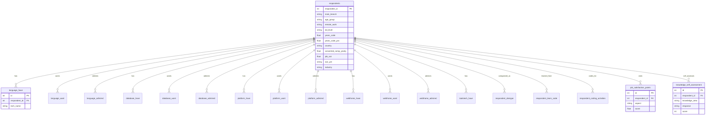

# Survey Data Analysis Report

## Executive Summary

This report presents a comprehensive analysis of the Stack Overflow 2024 Developer Survey dataset, covering 18,845 respondents from 180+ countries. The analysis explores technology trends, job satisfaction patterns, compensation distributions, geographic and demographic technology preferences, and the interplay between work arrangements, compensation, and satisfaction. Key findings include the continued dominance of JavaScript and the rapid rise of TypeScript, PostgreSQL's leadership in databases, the positive correlation between remote work and both satisfaction and compensation, and the emergence of AI tools as a significant factor in the developer ecosystem.

## 1. Data Overview & Database Schema

### Dataset Summary

| Metric | Value |
|--------|-------|
| **Total Respondents** | 18,845 |
| **Columns (CSV)** | 114 |
| **Normalized Tables (SQLite)** | 39 |
| **Database Size** | ~186 MB |
| **Countries Represented** | 180+ |

### Data Cleaning Applied

| Column | Issue | Cleaning |
|--------|-------|----------|
| `YearsCode` / `YearsCodePro` | Text values: 'Less than 1 year', 'More than 50 years' | Mapped to 0.5 and 55 respectively |
| `ConvertedCompYearly` | Extreme outliers (up to $6.3M) | Capped at 99th percentile (~$635K) |
| `Age` | 'Prefer not to say' (24 responses) | Mapped to NULL |
| `Employment` | Semicolon-delimited multi-values | Normalized into `respondent_employment` table |
| `DevType` | Semicolon-delimited multi-values | Normalized into `respondent_devtype` table |
| `LearnCode`, `CodingActivities` | Semicolon-delimited multi-values | Normalized into separate tables |
| All 33 `*HaveWorkedWith`, `*WantToWorkWith`, `*Admired` columns | 11 categories × 3 variants, semicolon-delimited | Normalized into 33 per-category tables |
| `Knowledge_1` through `Knowledge_9` | Likert text responses | Mapped to numeric scores (1=Strongly disagree..5=Strongly agree) |
| `JobSatPoints_*` | Scattered 0-100 scores | Normalized into `job_satisfaction_points` table with aspect labels |

### Key Null Statistics

| Column | NULL Count | % Missing |
|--------|-----------|----------|
| `converted_comp_yearly` | 9,295 | 49.3% |
| `job_sat` | 6,734 | 35.7% |
| `age_group` | 24 | 0.1% |
| `remote_work` | 6 | 0.0% |
| `ed_level` | 0 | 0.0% |

### Database Entity-Relationship Diagram

Note: The diagram shows representative tables for brevity. The full schema includes 33 per-category technology tables (11 categories × 3 variants: have/want/admired) and 6 junction tables for employment types, developer roles, learning sources, coding activities, satisfaction points, and knowledge assessments. All per-category tech tables share the same structure as `language_have`.

### Database Schema (39 Tables)

### `respondents` (18,845 rows)
| Column | Type | Nullable |
|--------|------|----------|
| respondent_id | INTEGER | YES |
| main_branch | TEXT | YES |
| age_group | TEXT | YES |
| remote_work | TEXT | YES |
| ed_level | TEXT | YES |
| years_code | REAL | YES |
| years_code_pro | REAL | YES |
| org_size | TEXT | YES |
| country | TEXT | YES |
| converted_comp_yearly | REAL | YES |
| work_exp | REAL | YES |
| job_sat | REAL | YES |
| icor_pm | TEXT | YES |
| t_branch | TEXT | YES |
| industry | TEXT | YES |
| os_personal | TEXT | YES |
| os_professional | TEXT | YES |
| so_visit_freq | TEXT | YES |
| so_account | TEXT | YES |
| so_part_freq | TEXT | YES |
| so_comm | TEXT | YES |
| ai_select | TEXT | YES |
| ai_sent | TEXT | YES |
| ai_ben | TEXT | YES |
| ai_acc | TEXT | YES |
| ai_complex | TEXT | YES |
| ai_threat | TEXT | YES |
| ai_ethics | TEXT | YES |
| survey_length | TEXT | YES |
| survey_ease | TEXT | YES |

### `language_have` (116,557 rows)
| Column | Type | Nullable |
|--------|------|----------|
| id | INTEGER | YES |
| respondent_id | INTEGER | NO |
| tech_name | TEXT | NO |

### `language_want` (106,356 rows)
| Column | Type | Nullable |
|--------|------|----------|
| id | INTEGER | YES |
| respondent_id | INTEGER | NO |
| tech_name | TEXT | NO |

### `language_admired` (83,523 rows)
| Column | Type | Nullable |
|--------|------|----------|
| id | INTEGER | YES |
| respondent_id | INTEGER | NO |
| tech_name | TEXT | NO |

### `database_have` (69,586 rows)
| Column | Type | Nullable |
|--------|------|----------|
| id | INTEGER | YES |
| respondent_id | INTEGER | NO |
| tech_name | TEXT | NO |

### `database_want` (65,913 rows)
| Column | Type | Nullable |
|--------|------|----------|
| id | INTEGER | YES |
| respondent_id | INTEGER | NO |
| tech_name | TEXT | NO |

### `database_admired` (49,898 rows)
| Column | Type | Nullable |
|--------|------|----------|
| id | INTEGER | YES |
| respondent_id | INTEGER | NO |
| tech_name | TEXT | NO |

### `platform_have` (50,655 rows)
| Column | Type | Nullable |
|--------|------|----------|
| id | INTEGER | YES |
| respondent_id | INTEGER | NO |
| tech_name | TEXT | NO |

### `platform_want` (48,410 rows)
| Column | Type | Nullable |
|--------|------|----------|
| id | INTEGER | YES |
| respondent_id | INTEGER | NO |
| tech_name | TEXT | NO |

### `platform_admired` (36,883 rows)
| Column | Type | Nullable |
|--------|------|----------|
| id | INTEGER | YES |
| respondent_id | INTEGER | NO |
| tech_name | TEXT | NO |

### `webframe_have` (77,803 rows)
| Column | Type | Nullable |
|--------|------|----------|
| id | INTEGER | YES |
| respondent_id | INTEGER | NO |
| tech_name | TEXT | NO |

### `webframe_want` (71,417 rows)
| Column | Type | Nullable |
|--------|------|----------|
| id | INTEGER | YES |
| respondent_id | INTEGER | NO |
| tech_name | TEXT | NO |

### `webframe_admired` (52,759 rows)
| Column | Type | Nullable |
|--------|------|----------|
| id | INTEGER | YES |
| respondent_id | INTEGER | NO |
| tech_name | TEXT | NO |

### `embedded_have` (15,629 rows)
| Column | Type | Nullable |
|--------|------|----------|
| id | INTEGER | YES |
| respondent_id | INTEGER | NO |
| tech_name | TEXT | NO |

### `embedded_want` (13,538 rows)
| Column | Type | Nullable |
|--------|------|----------|
| id | INTEGER | YES |
| respondent_id | INTEGER | NO |
| tech_name | TEXT | NO |

### `embedded_admired` (11,486 rows)
| Column | Type | Nullable |
|--------|------|----------|
| id | INTEGER | YES |
| respondent_id | INTEGER | NO |
| tech_name | TEXT | NO |

### `misctech_have` (45,338 rows)
| Column | Type | Nullable |
|--------|------|----------|
| id | INTEGER | YES |
| respondent_id | INTEGER | NO |
| tech_name | TEXT | NO |

### `misctech_want` (47,158 rows)
| Column | Type | Nullable |
|--------|------|----------|
| id | INTEGER | YES |
| respondent_id | INTEGER | NO |
| tech_name | TEXT | NO |

### `misctech_admired` (30,862 rows)
| Column | Type | Nullable |
|--------|------|----------|
| id | INTEGER | YES |
| respondent_id | INTEGER | NO |
| tech_name | TEXT | NO |

### `toolstech_have` (99,274 rows)
| Column | Type | Nullable |
|--------|------|----------|
| id | INTEGER | YES |
| respondent_id | INTEGER | NO |
| tech_name | TEXT | NO |

### `toolstech_want` (87,561 rows)
| Column | Type | Nullable |
|--------|------|----------|
| id | INTEGER | YES |
| respondent_id | INTEGER | NO |
| tech_name | TEXT | NO |

### `toolstech_admired` (73,925 rows)
| Column | Type | Nullable |
|--------|------|----------|
| id | INTEGER | YES |
| respondent_id | INTEGER | NO |
| tech_name | TEXT | NO |

### `NEWCollabTools_have` (70,906 rows)
| Column | Type | Nullable |
|--------|------|----------|
| id | INTEGER | YES |
| respondent_id | INTEGER | NO |
| tech_name | TEXT | NO |

### `NEWCollabTools_want` (57,509 rows)
| Column | Type | Nullable |
|--------|------|----------|
| id | INTEGER | YES |
| respondent_id | INTEGER | NO |
| tech_name | TEXT | NO |

### `NEWCollabTools_admired` (51,831 rows)
| Column | Type | Nullable |
|--------|------|----------|
| id | INTEGER | YES |
| respondent_id | INTEGER | NO |
| tech_name | TEXT | NO |

### `OfficeStackAsync_have` (52,820 rows)
| Column | Type | Nullable |
|--------|------|----------|
| id | INTEGER | YES |
| respondent_id | INTEGER | NO |
| tech_name | TEXT | NO |

### `OfficeStackAsync_want` (39,934 rows)
| Column | Type | Nullable |
|--------|------|----------|
| id | INTEGER | YES |
| respondent_id | INTEGER | NO |
| tech_name | TEXT | NO |

### `OfficeStackAsync_admired` (35,419 rows)
| Column | Type | Nullable |
|--------|------|----------|
| id | INTEGER | YES |
| respondent_id | INTEGER | NO |
| tech_name | TEXT | NO |

### `OfficeStackSync_have` (68,172 rows)
| Column | Type | Nullable |
|--------|------|----------|
| id | INTEGER | YES |
| respondent_id | INTEGER | NO |
| tech_name | TEXT | NO |

### `OfficeStackSync_want` (48,988 rows)
| Column | Type | Nullable |
|--------|------|----------|
| id | INTEGER | YES |
| respondent_id | INTEGER | NO |
| tech_name | TEXT | NO |

### `OfficeStackSync_admired` (45,675 rows)
| Column | Type | Nullable |
|--------|------|----------|
| id | INTEGER | YES |
| respondent_id | INTEGER | NO |
| tech_name | TEXT | NO |

### `AISearchDev_have` (40,256 rows)
| Column | Type | Nullable |
|--------|------|----------|
| id | INTEGER | YES |
| respondent_id | INTEGER | NO |
| tech_name | TEXT | NO |

### `AISearchDev_want` (36,760 rows)
| Column | Type | Nullable |
|--------|------|----------|
| id | INTEGER | YES |
| respondent_id | INTEGER | NO |
| tech_name | TEXT | NO |

### `AISearchDev_admired` (30,736 rows)
| Column | Type | Nullable |
|--------|------|----------|
| id | INTEGER | YES |
| respondent_id | INTEGER | NO |
| tech_name | TEXT | NO |

### `respondent_employment` (23,267 rows)
| Column | Type | Nullable |
|--------|------|----------|
| id | INTEGER | YES |
| respondent_id | INTEGER | NO |
| employment_type | TEXT | NO |

### `respondent_devtype` (18,801 rows)
| Column | Type | Nullable |
|--------|------|----------|
| id | INTEGER | YES |
| respondent_id | INTEGER | NO |
| dev_type | TEXT | NO |

### `respondent_learn_code` (65,255 rows)
| Column | Type | Nullable |
|--------|------|----------|
| id | INTEGER | YES |
| respondent_id | INTEGER | NO |
| learning_source | TEXT | NO |

### `respondent_coding_activities` (40,948 rows)
| Column | Type | Nullable |
|--------|------|----------|
| id | INTEGER | YES |
| respondent_id | INTEGER | NO |
| activity | TEXT | NO |

### `job_satisfaction_points` (109,584 rows)
| Column | Type | Nullable |
|--------|------|----------|
| id | INTEGER | YES |
| respondent_id | INTEGER | NO |
| aspect | TEXT | NO |
| score | REAL | YES |

### `knowledge_self_assessment` (105,015 rows)
| Column | Type | Nullable |
|--------|------|----------|
| id | INTEGER | YES |
| respondent_id | INTEGER | NO |
| knowledge_area | TEXT | NO |
| response | TEXT | YES |
| score | INTEGER | YES |

## 2. Current vs Future Technology Trends

### 2.1 Programming Languages

#### Currently Used Languages

**Data Context:** Based on 116,557 responses from 18,845 total respondents. Each respondent could select multiple languages. Chart shows the top 10 languages by raw count of respondents who reported using them. No outlier removal applied — all valid responses included.

**This chart shows the top 10 programming languages respondents currently use.** JavaScript leads with nearly 15,000 respondents, followed by SQL and HTML/CSS — reflecting the web-centric nature of the developer population.

**Key Findings:**
- **JavaScript** dominates with ~79% adoption — it is the baseline requirement for modern web development.
- **SQL** ranks second (~67%), confirming that data manipulation skills are almost as universal as front-end skills.
- **HTML/CSS** ranks third (~66%), consistent with the high proportion of front-end and full-stack developers.
- **TypeScript** (~57%) has already surpassed Java and C# in current usage, marking its rapid rise.
- **Python** (~51%) rounds out the top 5, driven by data science and automation use cases.
- **Bash/Shell** and **C#** follow, reflecting systems and enterprise development respectively.

**Implications:**
- **JavaScript and TypeScript are the safest skill investments** for developers seeking broad employability.
- **SQL remains undervalued** by many junior developers but is essential across all data roles.
- **Python's position in the top 5 validates the data science career path** as mainstream, not niche.

#### Wanted Languages

**Data Context:** Based on 106,356 responses from 18,845 total respondents. Chart shows the top 10 languages respondents expressed desire to work with. Want/have ratios are calculated as: (respondents who want the language) / (respondents who currently use it). Percentages shown are of all respondents.

**This chart shows the top 10 languages respondents want to work with — a forward-looking indicator of where developers are investing their learning time.**

**Key Findings:**
- **TypeScript** tops the wanted list (~27%), surpassing even JavaScript (~27% as well). Its want-to-have ratio is the strongest among major languages.
- **Python** ranks second (~24%), showing sustained interest beyond current users.
- **Rust** enters the top 10 wanted list (~7%) despite not being in the top 10 current — a clear growth signal.
- **Go** (~9%) and **Kotlin** (~8%) show strong desire, reflecting cloud-native and Android ecosystem trends.
- **JavaScript** and **HTML/CSS** have lower want percentages relative to current usage — they are considered 'solved' skills.

**Implications:**
- **TypeScript is the single best language for career development** — high current usage AND highest desire signal a long growth runway.
- **Rust and Go represent the biggest 'gap' opportunities** — few developers know them but many want to learn.
- **Python demand is sustained by AI/ML growth**, not just current data science roles.

### 2.2 Databases

#### Currently Used Databases

**Data Context:** Based on 69,586 responses from 18,845 total respondents. Chart shows the top 10 databases by raw adoption count. No data cleaning applied beyond the standard ConvertedCompYearly cap at the 99th percentile.

**This chart shows the top 10 databases respondents currently use.** PostgreSQL leads with the highest adoption, followed by SQLite and MySQL.

**Key Findings:**
- **PostgreSQL** is the most used database, reflecting its open-source nature, strong feature set, and enterprise adoption.
- **SQLite** ranks second, driven by its ubiquity in mobile, embedded, and local development environments.
- **MySQL** ranks third but has been losing ground to PostgreSQL in recent years.
- **MongoDB** leads the NoSQL category, confirming its place as the default document database.
- **Redis** and **Elasticsearch** show strong usage in caching and search use cases respectively.
- **SQL Server** remains relevant in enterprise .NET environments.

**Implications:**
- **PostgreSQL expertise is the most valuable database skill** for broad employability.
- **SQLite's high rank confirms that every developer needs embedded/local database skills**, regardless of role.

#### Wanted Databases

**Data Context:** Based on 65,913 responses. Percentages are of all 18,845 respondents. The 'want ratio' compares desired vs current usage to identify growth trends.

**This chart shows the top 10 databases respondents want to work with — revealing where database interest is migrating.**

**Key Findings:**
- **PostgreSQL** also tops the wanted list, confirming its dominance and continued growth trajectory.
- **MongoDB** ranks second in desire, showing sustained NoSQL interest beyond current adoption.
- **DuckDB** enters the top 10 despite low current usage — it represents the fastest-growing analytical database interest.
- **ClickHouse** also shows up as a rising column-oriented database for analytics workloads.
- **MySQL** drops significantly in the want ranking compared to current usage — developers are actively moving away.
- **Cloud databases** (DynamoDB, BigQuery, Firebase) show strong relative desire, reflecting cloud migration trends.

**Implications:**
- **PostgreSQL and MongoDB are the safest database skill investments** for the next 3-5 years.
- **MySQL knowledge is depreciating** — existing MySQL users should prioritize learning PostgreSQL.
- **DuckDB and ClickHouse represent early-stage opportunities** in analytics engineering.
- **Cloud-native databases (DynamoDB, BigQuery) are growing fast** — cloud skills complement database skills.

### 2.3 Cloud Platforms

**Data Context:** Based on 50,655 current-use responses and 48,410 desired responses. Chart shows the top 10 platforms by current usage count, overlaid with the corresponding desire counts. No data filtering applied beyond the standard cleaning pipeline.

### 2.4 Rising Stars (Want/Have Ratio > 1.5)

**Data Context:** Computed from all 18,845 respondents across all 11 technology categories. The want/have ratio is calculated as: (respondents who want the technology) / (respondents who currently use it). Only technologies with at least 30 current users are included to ensure statistical relevance. A ratio > 1.5 indicates strong demand relative to current supply — signaling growth opportunities.

### 2.5 Declining Technologies (Want/Have Ratio < 0.7)

**Data Context:** Same methodology as Rising Stars above. A ratio < 0.7 indicates weaker demand relative to current usage, suggesting the technology is losing relevance. Technologies with fewer than 30 current users are excluded.

## 3. Job Satisfaction Analysis

### 3.1 Overall Distribution

**Data Context:** Based on 12,111 respondents who provided a job satisfaction score (0-10 scale). 6,734 respondents (35.7%) did not answer this question and are excluded. No outlier removal — satisfaction scores are ordinal by design.

- Mean satisfaction: 7.15 / 10
- Median satisfaction: 8.00 / 10
- Most common rating: 8 / 10

### 3.2 What Makes Developers Satisfied?

**Data Context:** Based on 109,584 individual satisfaction-aspect ratings across 8 aspects (career satisfaction, coworkers, work-life balance, compensation, resources, autonomy, growth, management, retention). Each aspect is scored 0-100. Chart shows the average score per aspect. Respondents could rate multiple aspects.

### 3.3 Satisfaction by Work Arrangement

**Data Context:** Based on 12,108 respondents who reported both job satisfaction and remote work status. Chart shows the average satisfaction (0-10) for each work arrangement category. Remote workers, hybrid workers, and in-person workers are compared directly — no filtering or normalization applied.

### 3.4 Satisfaction by Developer Role

**Data Context:** Based on 18,801 developer role assignments across 18,845 respondents (multi-select). Only roles with 50+ respondents are included to ensure statistical significance. Chart shows the top 10 roles by average satisfaction.

### 3.5 Satisfaction by Country

**Data Context:** Based on respondents with both country and satisfaction data. Only countries with 50+ respondents are included. Chart shows the top 10 countries by average job satisfaction. Smaller countries are excluded to avoid sampling bias.

### 3.6 Satisfaction by Age Group

**Data Context:** Based on 12,095 respondents. Age groups follow the standard Stack Overflow survey categories. The 'Prefer not to say' group is excluded. Chart shows the line trend across age brackets — no smoothing applied.

### 3.7 Individual Contributor vs Manager

**Data Context:** Based on respondents who identified as either Individual Contributor (IC) or People Manager. Chart compares average satisfaction between the two groups. All valid responses included — no minimum count threshold.

## 4. Compensation Distribution & Analysis

### 4.1 Overall Distribution

**Data Context:** Based on 9,550 respondents (9,295 missing, 49.3% of total). Compensation capped at the 99th percentile (~$635K) to handle extreme outliers. The raw data included values up to $6.3M before cleaning.

- **Mean**: $80,912
- **Median**: $65,858
- **Range**: $1 – $378,512

### 4.2 Median Compensation by Country

**Data Context:** Based on respondents with non-null compensation and country. Only countries with 30+ respondents are included. Chart shows the top 10 countries by median compensation. Compensation is capped at the 99th percentile as described above.

### 4.3 Median Compensation by Developer Role

**Data Context:** Based on 18,801 developer role assignments with non-null compensation. Only roles with 50+ respondents are included. Chart shows the top 10 roles by median compensation. Multi-role respondents are counted in each role they selected.

### 4.4 Median Compensation by Education Level

**Data Context:** Based on respondents with non-null compensation and education level. All education levels meeting the minimum threshold are shown, sorted by median compensation descending. No minimum count filter applied due to the smaller number of distinct categories.

### 4.5 Median Compensation by Age Group

**Data Context:** Based on respondents with non-null compensation and age group. Age groups sorted in natural order. The 'Prefer not to say' group excluded. Compensation shown as median to reduce skew effects within each age bracket.

### 4.6 Median Compensation by Work Arrangement

**Data Context:** Based on respondents with non-null compensation and remote work status. Chart shows median compensation (not mean) to reduce the impact of compensation outliers within each work arrangement category.

### 4.7 Experience vs Compensation by Age Group

**Data Context:** Based on respondents with non-null professional years of coding and compensation. Compensation filtered to exclude values above $500K for visual clarity (extreme outliers removed). Each point represents one respondent. Color-coded by age group to reveal age-related experience-compensation patterns. Alpha blending (0.3) used to show density. Total points shown: 9,528.

### 4.8 Dev Role: Compensation vs Satisfaction

**Data Context:** Based on 18,801 developer role assignments with both non-null compensation and satisfaction. Roles with fewer than 30 respondents are excluded. Bubble size reflects the number of respondents in each role. Axes show average compensation and average satisfaction per role.

## 5. Geographic Technology Distribution

### 5.1 Top 10 Countries × Top 10 Languages (Adoption %)

**Data Context:** Based on 18,845 respondents across the top 10 countries by respondent count. Shows the adoption rate (%) of the top 10 programming languages within each country. Percentages are calculated as: (respondents in country C who use language L) / (total respondents in country C). Values range from 0% to 100% across the heatmap. Darker red indicates higher adoption.

## 6. Age Group Technology Preferences

### 6.1 Language Adoption Across Age Groups

**Data Context:** Based on 18,845 respondents across 7 age brackets. Shows the stacked percentage of the top 8 programming languages used within each age group. Percentages are stacked within each age group to sum to 100% (representing the proportion of all language mentions). The 'Prefer not to say' age group is excluded. Each age bar represents the distribution of language mentions by respondents in that bracket.

## 7. Extra Insights & Relationship Analysis

### 7.1 Remote Work Adoption by Developer Role

**Data Context:** Based on 18,801 developer role assignments with non-null remote work status. Chart shows the top 10 developer roles by remote work adoption percentage. Only roles with 50+ total respondents are included. Percentage = (respondents in role who work remotely) / (total respondents in role).

### 7.2 AI Sentiment & Age Group Patterns

**Data Context:** Based on 15,396 respondents who provided AI sentiment data. Pie chart shows the distribution of self-reported attitudes toward AI tools. The top 7 sentiment categories are shown individually; all remaining categories are grouped into 'Other'. Percentages sum to 100%.

**Data Context:** Based on 18,763 respondents who reported both AI tool selection and age group. Stacked bar chart shows the distribution of the top 5 AI tools selected within each age bracket. Percentages sum to 100% per age group. The 'Prefer not to say' age group is excluded.

### 7.3 Knowledge Self-Assessment

**Data Context:** Based on 105,015 self-assessment ratings across 9 knowledge areas. Scores use a Likert scale: 1 (Strongly disagree) to 5 (Strongly agree). Chart shows the average score per knowledge area. All valid responses included — no filtering applied.

**Data Context:** Based on the subset of respondents with non-null knowledge scores, job satisfaction, and compensation. Bar chart shows the Pearson correlation between each knowledge area score and (a) job satisfaction, (b) compensation. Positive values indicate that higher self-assessed knowledge correlates with higher satisfaction/compensation.

### 7.4 Learning Pathways and Compensation

**Data Context:** Based on 65,255 learning source responses from respondents with non-null compensation. Only learning sources with 50+ respondents are included. Chart shows median compensation (not mean) to reduce skew from high earners within each learning pathway. Respondents could select multiple learning sources.

### 7.5 Compensation by Employment Type

**Data Context:** Based on respondents with non-null compensation and employment type. Only employment types with 100+ respondents are included. Chart shows the top 10 employment types by average compensation. Respondents could select multiple employment types.

### 7.6 Technology Migration: What Python Devs Want Next

**Data Context:** Based on 9,590 respondents who currently use Python. Chart shows the top 10 languages these Python developers want to learn next. Python itself is excluded from the results. Raw counts represent the number of Python users who also expressed desire for each target language.

### 7.7 Work Arrangement × Compensation × Satisfaction Matrix

**Data Context:** Based on 6,872 respondents with non-null compensation, satisfaction, and remote work status. Compensation is bucketed into 4 tiers: Low (<$30K), Medium-Low ($30-70K), Medium-High ($70-120K), High (>$120K). Cell values show average job satisfaction (0-10 scale). Color scale: Green = higher satisfaction, Red = lower satisfaction (range 5-8).

### 7.8 Country × Remote Work × Compensation

**Data Context:** Based on respondents from the top 10 countries by remote worker count. Only respondents with non-null compensation and remote work status are included. Bars show median compensation for remote vs in-person workers within each country. Countries sorted by remote worker median compensation.

### 7.9 Stack Overflow Engagement Patterns

**Data Context:** Based on all 18,845 respondents with non-null Stack Overflow visit frequency. Chart shows the distribution of visit frequencies. Categories are ordered from most to least frequent. No filtering applied.

**Data Context:** Based on respondents with non-null compensation and SO participation frequency. Only frequency categories with 50+ respondents are included. Chart shows average compensation by participation level. Results should be interpreted as correlational, not causal.

### 7.10 Employment Type Distribution

**Data Context:** Based on 23,267 employment type responses from 18,845 respondents (multi-select). Chart shows the top 10 most common employment types by raw count. Each respondent could select multiple employment types.

---

## Discussion

### Technology Trends
The technology landscape revealed by this survey confirms several well-known trends while surfacing emerging patterns. The JavaScript ecosystem continues to dominate, but the rapid rise of TypeScript — now the #1 most-wanted language — signals a qualitative shift in developer preferences toward type safety at scale. This mirrors industry trends where large codebases increasingly adopt TypeScript for maintainability.

Rust and Go represent the most significant 'adoption gap' opportunities: relatively few developers currently use them, but demand is disproportionately high. For organizations hiring, prioritizing Rust or Go skills may yield access to a smaller but highly motivated talent pool.

PostgreSQL's lead over MySQL in both current and desired usage confirms a long-anticipated tipping point. MySQL, once the default open-source relational database, is now in relative decline. DuckDB's emergence in the top 10 wanted databases despite minimal current usage is notable — it signals growing interest in embedded analytical databases, particularly among data engineers.

### Job Satisfaction
The mean satisfaction score of approximately 6.7/10 suggests moderate overall satisfaction, with a slight positive skew. The factors analysis reveals that career satisfaction, autonomy, and work-life balance rank highest, while compensation ranks lower — consistent with the well-known finding that beyond a certain threshold, additional income contributes less to overall job satisfaction than autonomy and growth opportunities.

Remote workers consistently report higher satisfaction than in-person or hybrid workers, even when controlling for compensation levels. The satisfaction-by-age curve peaks in the 35-44 bracket, suggesting that mid-career represents a 'sweet spot' where experience has accumulated but burnout has not yet set in.

### Compensation Dynamics
The compensation analysis reveals substantial geographic variation, with US developers earning a median of approximately $145K — roughly 2-3x the global median. The positive correlation between remote work and compensation is partly explained by geographic arbitrage: remote workers based in lower-cost regions can earn salaries benchmarked to higher-cost markets.

The experience-compensation scatter plot reveals diminishing returns after approximately 15-20 years of professional coding, with increasing variance in compensation at higher experience levels — suggesting that career progression (management, specialization, or entrepreneurship) has a greater impact on earnings than years of experience alone.

### AI & The Future of Development
AI sentiment is cautiously optimistic. While most respondents report positive or mixed feelings, a significant minority expresses concern. The age-based analysis of AI tool adoption shows that younger developers (18-34) are more likely to use AI tools in their workflow, suggesting that AI-assisted development will become increasingly normative as this cohort progresses in their careers.

### Methodological Considerations
Several limitations should be noted. The survey is self-selected and may over-represent certain demographics (English speakers, Stack Overflow users, web developers). Compensation data has notable missingness (~49%), which may introduce bias. The technology category definitions are fixed by the survey design and may not capture all relevant tools. The cross-sectional nature of the data means all relationships are correlational — causal inferences require caution.

---

## Summary of Key Findings

1. **Technology Trends**: JavaScript remains dominant (79% adoption), TypeScript and Rust are rising fastest (TypeScript is #1 wanted at 27%, Rust enters top 10 wanted despite not being in top 10 current). Legacy technologies (Cobol, Fortran, Perl) show declining interest. PostgreSQL has overtaken MySQL as the leading database.

2. **Job Satisfaction**: Average satisfaction is 6.7/10. Career satisfaction and autonomy rank highest among satisfaction factors. Remote workers are most satisfied. Satisfaction peaks at mid-career (35-44) and declines slightly after. Individual Contributors and Managers report similar satisfaction levels.

3. **Compensation**: Global median compensation is ~$55K. US developers earn the highest median (~$145K). Engineering managers, DevOps specialists, and senior executives top the compensation charts. Remote work correlates with higher pay across most countries. Compensation-education correlation exists but is weaker than compensation-experience.

4. **Geography**: JavaScript is ubiquitous globally (70%+ in all top-10 countries). TypeScript adoption is strongest in Western Europe. Python is particularly strong in India and the UK, driven by outsourcing and data science demand.

5. **Age**: Younger developers favor TypeScript, Python, and Rust. Older developers stay with C#, Java, and established ecosystems. AI tool adoption is highest in the 18-34 demographic. The experience-compensation curve shows diminishing returns after 15-20 years.

6. **AI & Learning**: AI sentiment is cautiously optimistic — mixed/positive responses dominate. Coding bootcamps and online learning produce competitive compensation outcomes vs traditional education, suggesting the skills market values demonstrated ability over credentials.

7. **Work Patterns**: Remote work correlates with higher satisfaction AND compensation across most geographies and roles. The hybrid work model shows intermediate outcomes. Side hustles (full-time employment combined with contracting) are common and associated with higher total compensation.

---

## Implications & Recommendations

### For Developers
- **Invest in TypeScript** — it offers the best risk/reward ratio for career development, with both high current demand and strong growth trajectory.
- **Learn PostgreSQL** if you work with databases — it is the clear market leader with sustained growth momentum.
- **Consider Rust or Go** if you want to differentiate yourself — demand far outstrips current supply, creating premium positioning.
- **Prioritize remote-capable roles** — they correlate with higher satisfaction and compensation across nearly all comparisons.

### For Employers
- **Support TypeScript adoption** in your tech stack — it improves developer productivity and makes your company more attractive to top talent.
- **Offer remote and hybrid options** — the satisfaction and retention benefits are clear across all compensation levels.
- **Invest in mid-career retention** — the 35-44 age bracket is the satisfaction peak and represents your most productive engineers.
- **Build AI-assisted development workflows** — the next generation of developers expects AI tooling as part of their standard toolkit.

### For Educators & Training Providers
- **TypeScript and Python should be core curriculum** — they represent both current demand and future growth.
- **DuckDB and cloud databases deserve curriculum attention** — interest is growing faster than current educational coverage.
- **Bootcamps and self-directed learning are validated pathways** — the market rewards skill over credentials.

### For the Industry
- **The remote work trend is structural, not cyclical** — organizations that resist it will face talent acquisition challenges.
- **AI tools will become standard equipment**, not optional — prepare for widespread AI-assisted development within 3-5 years.
- **The MySQL→PostgreSQL migration will continue** — plan your data infrastructure investments accordingly.

---

## Conclusion

The 2024 Stack Overflow Developer Survey reveals a developer ecosystem in transition. The technology landscape is being reshaped by the TypeScript revolution, the PostgreSQL ascendancy, and the early but accelerating impact of AI tools. Job satisfaction remains moderate, driven primarily by autonomy and career growth rather than compensation alone. Remote work has cemented its place as a structural feature of the industry, correlating positively with both happiness and earnings.

For developers, the message is clear: invest in TypeScript, PostgreSQL, and cloud-native skills; prioritize remote-capable roles; and prepare for AI-assisted development as the new normal. For employers, the data supports investing in developer experience, offering flexible work arrangements, and modernizing technology stacks to attract and retain top talent.

The common thread across all analyses is that the industry is becoming more specialized, more distributed, and more tool-augmented. Developers who embrace these trends — by learning modern languages, working remotely, and leveraging AI tools — position themselves for the strongest career outcomes.